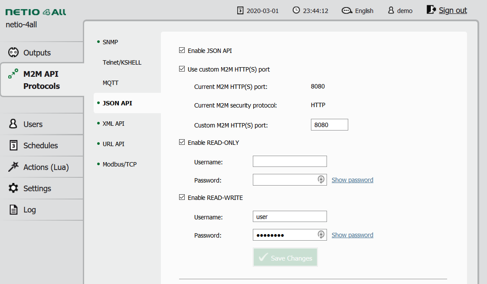

# Netio

python 3 Bindings and CLI for communication with NETIO Products devices

Install the latest package from pip
```bash
pip install Netio --upgrade
```
# API Interface

Login to your device and enable JSON API



Import Netio and create new instance with endpoint
```python
from Netio import Netio

n = Netio('http://netio-4ll.local:8080/netio.json', auth_rw=('admin', 'password'))
```

## HTTPS
When using HTTPS, you must provide correct certificate, or disable certificate verification altogether.

 1. Under `Settings->Network Configuration` enter correct hostname and domain. 
 2. Goto `Settings->Security Settings` and select *Generate new certificate*
 3. [Download](https://docs.digicert.com/manage-certificates/client-certificates-guide/manage-your-personal-id-certificate/windows-export-your-personal-id-certificate/) the certificate from your browser using browser

If you're accessing Netio wia IP address, set `verify=False` to disable certificate verification. 

Finally add `verify` parameter with path to downloaded certificate.
```pydocstring
n = Netio('http://netio-4ll.local:8080/netio.json', auth_rw=('admin', 'password'), verify='/path/to/cert.pem')
```


## Control
to set the output use either action, or integer value
```pydocstring
>>> n.set_output(1, 0)            # Set output 1 off
>>> n.set_output(1, n.ACTION.ON)  # Set output 1 on
```

To read the states of the outputs
```pydocstring
>>> for x in range(4):
>>>    print(n.get_output(x))
Output(ID=1, Name='out_1', State=1, Action=1, Delay=500, Current=0, PowerFactor=0.0, Load=0, Energy=13346833)
Output(ID=2, Name='out_2', State=0, Action=0, Delay=500, Current=0, PowerFactor=0.0, Load=0, Energy=2311032)
Output(ID=3, Name='out_3', State=1, Action=1, Delay=500, Current=8610, PowerFactor=1.0, Load=2062, Energy=11387035)
Output(ID=4, Name='out_4', State=1, Action=1, Delay=500, Current=11540, PowerFactor=1.0, Load=2768, Energy=21077736)
```

# CLI Interface
```
usage: Netio [-h] [-u U] [-p P] [-C] [-c CFG] [-v] [--no-cert-warning] [--version] DEVICE COMMAND ...

positional arguments:
  DEVICE                Netio device URL or alias from config
  COMMAND               device command
    get (GET, G, g)     GET output state
    set (SET, S, s)     SET output state
    info (INFO, I, i)   show device info

optional arguments:
  -h, --help            show this help message and exit
  -u U, --user U        M2M API username
  -p P, --password P    M2M API password
  -C, --cert            HTTPS Certificate
  -c CFG, --config CFG  Configuration file
  -v, --verbose         increase verbosity
  --no-cert-warning     Disable warnings about certificate's subjectAltName versus commonName
  --version             show program's version number and exit
```

## Commands

Netio CLI supports 3 different commands, here are some examples about how to use them. 
For more detailed description see `Netio device CMD --help`


### GET
Prints current state of outputs from device. Unless specified otherwise, all are returned

```
$ NETIO_PASSWORD=secretPass Netio -u read http://netio.local GET
id      State   Action  Delay   Current PFactor Load    Energy  Name
1       1       IGNORED 5000    0       0.0     0       2500    MyNetioOutput12
2       1       IGNORED 5000    127     0.58    17      2363    output_2
3       1       IGNORED 5000    0       0.0     0       0       output_3
4       1       IGNORED 5000    0       0.0     0       1327    Notebook
```

By default, the header with description is shown, it can be switched off with `--no-header`.
Default delimiter is tab, that can be changed with `--delimiter ';'` of `-d\;`

```
$ NETIO_PASSWORD=secretPass Netio -u read http://netio.local GET --delimiter ';' --no-header
1;1;IGNORED;5000;0;0.0;0;2500;MyNetioOutput12
2;1;IGNORED;5000;79;0.49;9;2364;output_2
3;1;IGNORED;5000;0;0.0;0;0;output_3
4;1;IGNORED;5000;0;0.0;0;1327;Notebook
```

To request single output just add positional argument with output ID

```
$ NETIO_PASSWORD=secretPass Netio -u read http://netio.local GET 2
id      State   Action  Delay   Current PFactor Load    Energy  Name
2       1       IGNORED 5000    80      0.49    9       2365    output_2
```

### SET

SET takes positional argument pairs ID - ACTION. At least one pair has to be provided.
Non zero value is returned when request does not succeed.

```
$ NETIO_PASSWORD=secretPass Netio -u write http://netio.local SET 1 ON 2 OFF 3 OFF
$ echo $?
0
```

To set action of all outputs at once, use `ALL` as ID.

```
$ NETIO_PASSWORD=secretPass Netio -u write http://netio.local SET ALL TOGGLE
```


**Warning**: When toggling all outputs at once there is no delay in between, with high loads this can cause current
 spike
 and trigger your breakers.


### INFO
Reports the state of the device

```
$ Netio -u write -p SecretPass http://netio.local INFO
Agent
   Model               NETIO 4All
   Version             3.4.0
   JSONVer             2.1
   DeviceName          myNetio
   VendorID            0
   OemID               0
   SerialNumber        24:A4:2C:33:27:78
   Uptime              1456245
   Time                2020-06-01T13:15:27+01:00
   NumOutputs          4
GlobalMeasure
   Voltage             230.6
   Frequency           49.9
   TotalCurrent        85
   OverallPowerFactor  0.51
   TotalLoad           10
   TotalEnergy         6195
   EnergyStart         2020-03-31T06:38:11+01:00
```

## Configuration file
 
You can also use configuration file, specified wia `--config netio.ini` or wia `NETIO_CONFIG` environment variable.
For explanation and example of the file configuration see [examples](examples/netio.example.ini)

## Credentials

Specifying credentials wia command line arguments is not prohibited, but it's advised against, 
as anyone on the system can see your username and password.

You can specify username and password either wia configuration file or wia Environmental variables

 - `NETIO_USER` for username.
 - `NETIO_PASSWORD` for password.


### Parameter lookup
when supplying for example password, it's looked up in this order:
  1. command line argument
  2. ENV variable
  3. configuration file (if supplied)
     1. special section
     2. DEFAULT section
  4. Default value (if applicable)